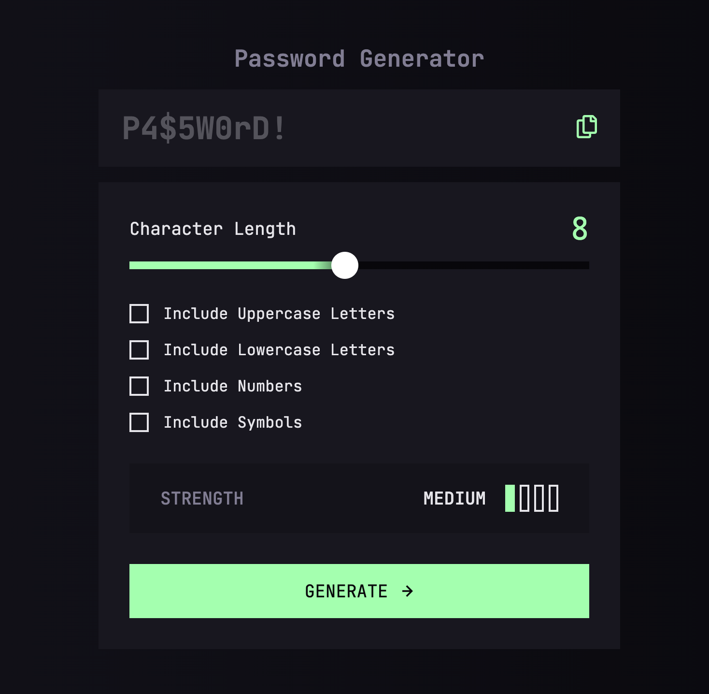
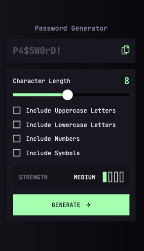
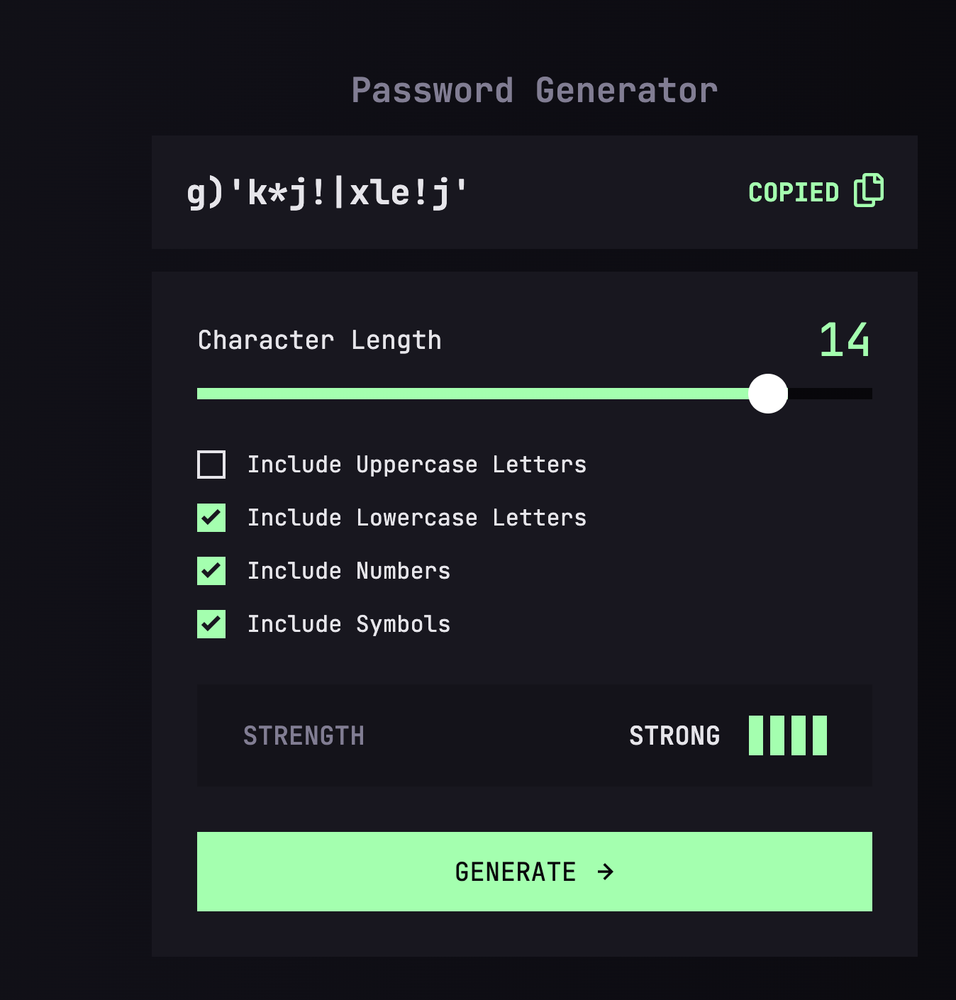

# Frontend Mentor - Password generator app solution

This is a solution to the [Password generator app challenge on Frontend Mentor](https://www.frontendmentor.io/challenges/password-generator-app-Mr8CLycqjh). Frontend Mentor challenges help you improve your coding skills by building realistic projects.

## Table of contents

- [Overview](#overview)
  - [The challenge](#the-challenge)
  - [Screenshot](#screenshot)
  - [Links](#links)
- [My process](#my-process)
  - [Built with](#built-with)
  - [What I learned](#what-i-learned)
  - [Useful resources](#useful-resources)
  - [AI Collaboration](#ai-collaboration)
- [Author](#author)

## Overview

### The challenge

Users should be able to:

- Generate a password based on the selected inclusion options
- Copy the generated password to the computer's clipboard
- See a strength rating for their generated password
- View the optimal layout for the interface depending on their device's screen size
- See hover and focus states for all interactive elements on the page

### Screenshot



*Desktop*



*Mobile*



*Active states*

### Links

- Live Site URL: [zippy-crisp-da3bbe.netlify.app](https://zippy-crisp-da3bbe.netlify.app)

## My process

### Built with

- Semantic HTML5 markup
- CSS custom properties
- Flexbox
- Vanilla JavaScript
- Mobile-first workflow

### What I learned

I managed to practice a lot of JavaScript concepts with this project, from changing states to dynamic styling. I'm very proud of implementing the copy functionality, which makes the website not only a practice project but also something useful in practice.

```js
// Copy button
copyBtn.addEventListener("click", () => {
  const targetElement = document.querySelector(copyBtn.dataset.copy);
  const textToCopy = targetElement.textContent;
  console.log(textToCopy);
  navigator.clipboard.writeText(textToCopy).then(() => {
    copyText.classList.remove("non-display");
    copyText.classList.add("copied-text");
    setTimeout(() => {
      copyText.classList.remove("copied-text");
      copyText.classList.add("non-display");
    }, 2000);
  });
});
```

The hardest part of this project for me was implementing the dynamic strength checker. I created two helper functions for it. The first one, `getStrength`, takes two parameters: `length` and `typeCount`, which are the length of the password and the number of checked checkboxes, respectively. Depending on the password length, I assign a different number of `lengthPoints`. Then I add the length points to the number of checked checkboxes to get a final score, which I store in the `score` variable. Depending on the score, I return a different object with `label`, `bars` and `color` properties.

Next, I pass the object from `getStrength` to `updateStrengthMeter` as an argument. For each bar, I remove the styling classes so that only the basic unfilled bars remain. Whenever `index < strength.bars` is true, I add the styling class based on the argument's color. After that, I set the text from `strength.label`.

```javascript
// Copy button
function getStrength(length, typeCount) {
  let lengthPoints = 0;
  if (length >= 12) {
    lengthPoints = 3;
  } else if (length >= 8) {
    lengthPoints = 2;
  } else if (length >= 6) {
    lengthPoints = 1;
  }

  const score = lengthPoints + typeCount;

  if (score >= 6) {
    return { label: "Strong", bars: 4, color: "green" };
  } else if (score >= 4) {
    return { label: "Medium", bars: 3, color: "yellow" };
  } else if (score >= 2) {
    return { label: "Weak", bars: 2, color: "orange" };
  } else {
    return { label: "Too Weak!", bars: 1, color: "red" };
  }
}

function updateStrengthMeter(strength) {
  bars.forEach((bar, index) => {
    bar.classList.remove(
      "strength-bar-green",
      "strength-bar-yellow",
      "strength-bar-orange",
      "strength-bar-red",
    );
    if (index < strength.bars) {
      bar.classList.add(`strength-bar-${strength.color}`);
    }
  });
  strengthText.innerText = strength.label;
}
```

I also learned how to style a slider that changes its background color.

```CSS
.slider {
  appearance: none;
  -webkit-appearance: none;
  width: 100%;
  height: 0.8rem;
  background: linear-gradient(90deg, var(--green-200) 40%, var(--grey-950) 50%);
  outline: none;
}

.slider::-webkit-slider-thumb {
  -webkit-appearance: none;
  width: 2.8rem;
  height: 2.8rem;
  background: white;
  border-radius: 5rem;
}

.slider:focus::-webkit-slider-thumb {
  border: 0.2rem solid var(--green-200);
  background-color: var(--grey-900);
}
```

### Useful resources

- [youtu.be/Aw2NT4EDO3M?si=S-RMVtZr0w0l2NuA](https://youtu.be/Aw2NT4EDO3M?si=S-RMVtZr0w0l2NuA) - This video helped me implement the copy functionality on my web page.
- [youtu.be/BrpiNUf2XCk?si=1xalY2EGP_8GI9nP](https://youtu.be/BrpiNUf2XCk?si=1xalY2EGP_8GI9nP) - This is an amazing video that finally helped me understand how to properly style a dynamic slider. I'd recommend it to anyone still learning this concept.
- [youtu.be/62qN2RcpIAE?si=wlRFUKDmLuB4Sgg2](https://youtu.be/62qN2RcpIAE?si=wlRFUKDmLuB4Sgg2) - This was a very good refresher on the `classList` property.

### AI Collaboration

For this project, I used GLM-5.3 to guide me through concepts I didn't know before. This helps demonstrate your ability to work effectively with AI assistants.

- OpenCode with GLM-5.3
- Used mainly for debugging and asking questions about common implementation patterns
- It gave me useful suggestions, but sometimes I wanted to take a different approach from the one the model suggested. However, the model wasn't flexible enough to adapt to my solution and kept changing it.

## Author

- Frontend Mentor - [www.frontendmentor.io/profile/gavrilov-n](https://www.frontendmentor.io/profile/gavrilov-n)
- LinkedIn - [www.linkedin.com/in/nikita-gavrilov1337/?isSelfProfile=true](https://www.linkedin.com/in/nikita-gavrilov1337/?isSelfProfile=true)
